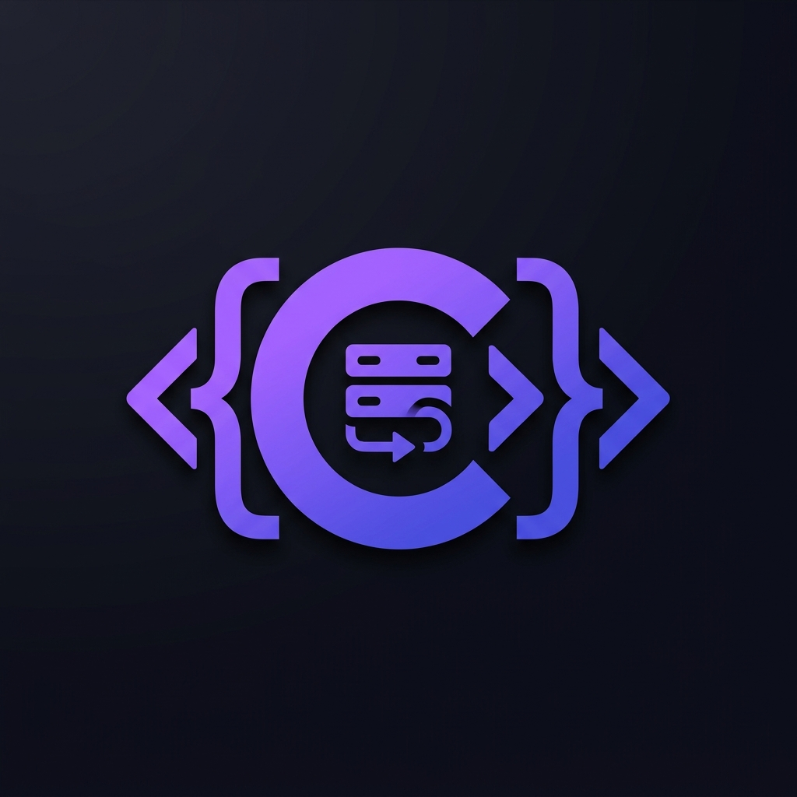

# ⚡ C-Script LocalHost Panel

  

  <strong>Modern, High-Performance Local Development Environment for PHP, NGINX & MySQL on Windows</strong> 
  <em>A fast, lightweight, all-in-one local development environment for Windows.</em>

  
  
  
  
  

---

## 📄 License & Terms of Use

Copyright © 2026 **C.S. Ranasinha (Chamika Sandeepa)**. All Rights Reserved.

This software is proprietary. Free to download and use for personal, educational, and professional development. **Unauthorized copying, cloning, modification, redistribution, or claiming of copyright is strictly prohibited.** See [LICENSE](LICENSE) for details.